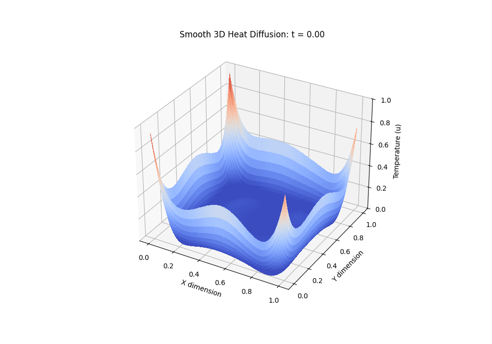
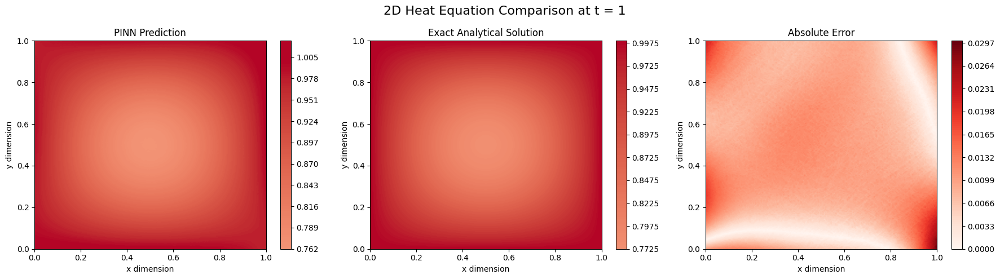

# Equação do Calor 2D

Este diretório contém os experimentos da **Equação do Calor Bidimensional** resolvida através de Physics-Informed Neural Networks (PINNs), testando diferentes condições de contorno e configurações físicas.

## Formulação Matemática Geral

A propagação do calor em uma chapa (2 dimensões espaciais) é governada pela equação:

$$
\frac{\partial u}{\partial t} = \alpha \left( \frac{\partial^2 u}{\partial x^2} + \frac{\partial^2 u}{\partial y^2} \right) \quad \text{em} \quad \Omega \times [0, T]
$$

Onde $u(t, x, y)$ é a temperatura, e $\alpha$ é o coeficiente de difusividade térmica. A função de perda total geralmente segue o formato:

$$
\mathcal{L} = \mathcal{L}_{PDE} + \lambda_{BC}\,\mathcal{L}_{BC} + \lambda_{IC}\,\mathcal{L}_{IC}
$$

## Experimentos Disponíveis

Os experimentos não estão mais divididos em subpastas, mas sim nomeados explicitamente de acordo com a condição de contorno e a configuração do problema. As imagens geradas por cada experimento são salvas na pasta `assets/` com o mesmo nome do notebook correspondente.

### 1. Dirichlet (`edges_1deg_center_0deg.ipynb`)

**Matemática da borda:** Temperatura fixada nas bordas do domínio: $u\big|_{\partial\Omega} = g(x, y)$

Para impor a condição, o resíduo minimizado é:
$$
\mathcal{L}_{BC} = \frac{1}{N_{bc}} \sum_{i=1}^{N_{bc}} \left( u_\theta(t, x_i, y_i) - g(x_i, y_i) \right)^2
$$

**Resultados (`assets/edges_1deg_center_0deg/`):**

### 2. Neumann (`base_experiment.ipynb`)

**Matemática da borda:** Fluxo de calor especificado nas bordas: $\frac{\partial u}{\partial \mathbf{n}}\bigg|_{\partial\Omega} = h(x, y)$

O caso $h = 0$ representa **bordas termicamente isoladas**. A imposição requer o cálculo da derivada direcional (Autograd):
$$
\mathcal{L}_{BC} = \frac{1}{N_{bc}} \sum_{i=1}^{N_{bc}} \left( \frac{\partial u_\theta}{\partial \mathbf{n}}(t, x_i, y_i) - h(x_i, y_i) \right)^2
$$

**Resultados (`assets/base_experiment/`):**
*(Execute o notebook para gerar os resultados correspondentes nesta pasta)*
