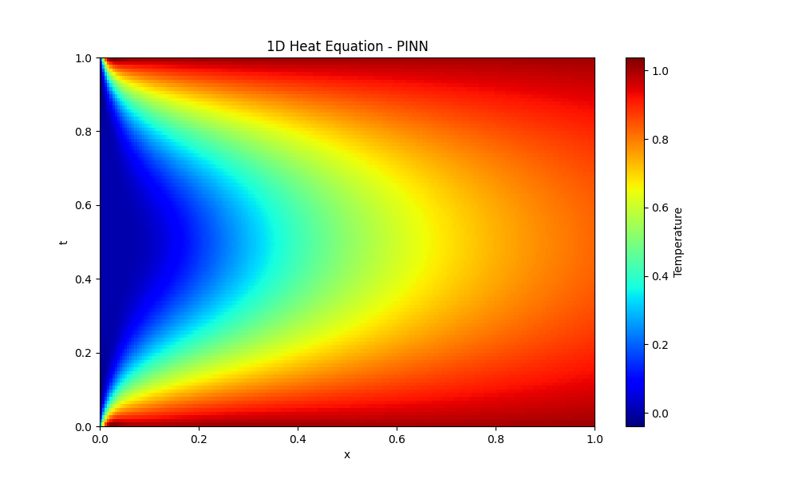
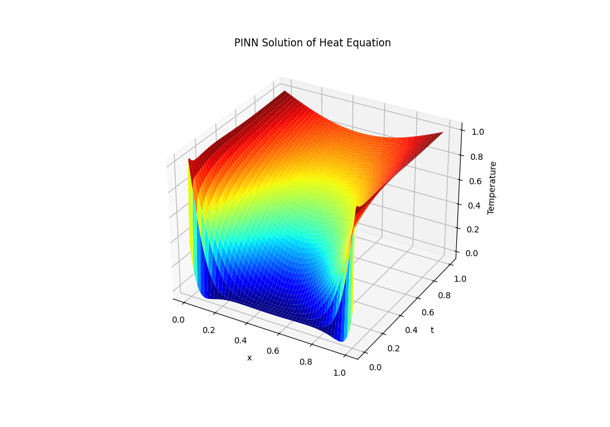

# Equação do Calor 1D

Este diretório contém os experimentos para a resolução da **Equação do Calor Unidimensional** utilizando Physics-Informed Neural Networks (PINNs).

## Formulação Matemática

A Equação do Calor em 1D descreve a distribuição de calor em uma região ao longo do tempo. A forma geral é:

$$
\frac{\partial u}{\partial t} - \alpha \frac{\partial^2 u}{\partial x^2} = 0 \quad \text{em} \quad \Omega \times [0, T]
$$

Onde:
- $u(t, x)$ é a temperatura no tempo $t$ e posição $x$.
- $\alpha$ é a difusividade térmica.

A função de perda (Loss Function) utilizada no treinamento da rede neural é composta por:
1. **MSE Data (Opcional)**: Erro nas medições/condições iniciais ($t=0$).
2. **MSE PDE**: O resíduo da Equação Diferencial Parcial avaliado em pontos de coligação (collocation points).
3. **MSE BC**: Erro nas condições de contorno (Dirichlet, Neumann, etc).

$$
\mathcal{L} = \lambda_1 \mathcal{L}_{PDE} + \lambda_2 \mathcal{L}_{BC} + \lambda_3 \mathcal{L}_{IC}
$$

## Estrutura

- `edges_at_1deg.ipynb`: Código principal com o loop de treinamento da PINN.
- `assets/`: Resultados e gráficos das simulações.

## Resultados

Exemplo da propagação de calor ao longo do domínio 1D (dependendo do tempo $t$):

